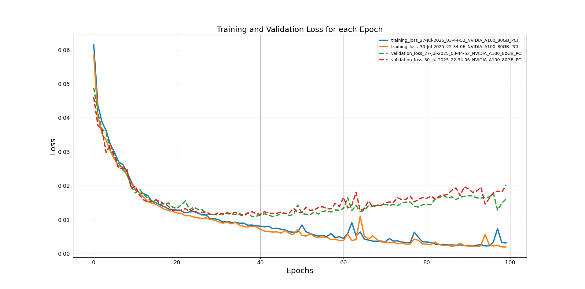
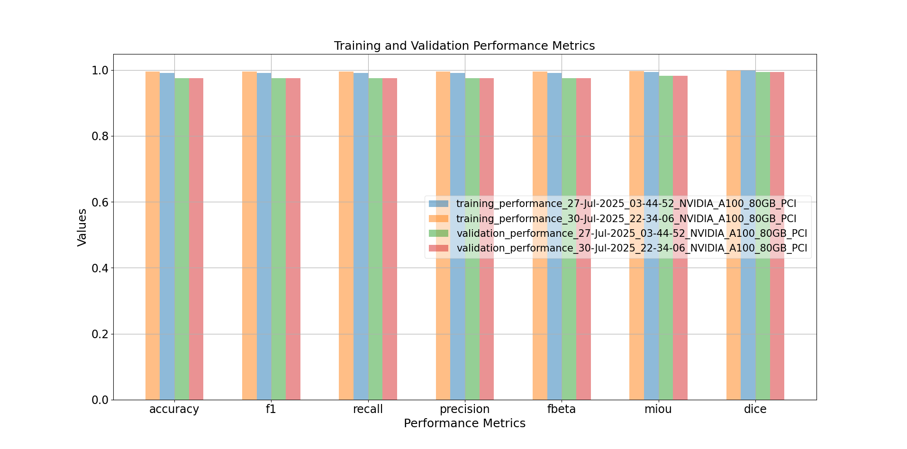

# Models

## Models on Hugging Face
The models are hosted on Hugging Face at: https://huggingface.co/mxochicale/ready_hf
You can either: Clone the repository to download all models and files, or Use wget to download individual files as needed.

After downloading, make sure to move the models into their corresponding directory, following this format:
`~/datasets/ready/mobious/models_a10080gb/{DATE_GPU_TYPE}` where `{DATE_GPU_TYPE}` refers to the training date and the GPU type used (e.g., 27-Jul-2025_NVIDIA_A100_80GB_PCI). This can be achieved using the following: `cp source/directory/ /destination/directory/`.

Note: If you would like to use the model weights, ensure you download the actual model weights from the Hugging Face repository. This can be accomplished by using the following:
`wget https://huggingface.co/mxochicale/ready_hf/resolve/main/models/{model_folder}/{model_weights.pth}`. Otherwise, you will encounter an UnpicklingError.

## Model Path
Below is an example of how the models and files are organised after training and optimisation:
```bash
~/datasets/ready/mobious/models_a10080gb/27-Jul-2025_03-44-52_NVIDIA_A100_80GB_PCI$ tree -h
[4.0K]  .
├── [  18]  accuracy_value_27-Jul-2025_03-44-52.csv
├── [2.1K]  training_loss_values_27-Jul-2025_03-44-52.csv
├── [ 234]  training_performance_27-Jul-2025_03-44-52.json
├── [2.0K]  validation_loss_values_27-Jul-2025_03-44-52.csv
├── [ 235]  validation_performance_27-Jul-2025_03-44-52.json
├── [ 89M]  weights_27-Jul-2025_03-44-52.onnx
├── [ 89M]  weights_27-Jul-2025_03-44-52.pth
├── [ 91M]  weights_27-Jul-2025_03-44-52-sim-BHWC.NVIDIARTXA20008GBLaptopGPU.8.6.20.trt.10.3.0.26.engine.fp32
├── [ 89M]  weights_27-Jul-2025_03-44-52-sim-BHWC.onnx
└── [ 89M]  weights_27-Jul-2025_03-44-52-sim.onnx
0 directories, 10 files
```

## Preparations
### Conversion to ONNX (using .pth models) and ONNX symplification 
```
cd $HOME_REPO
vim configs/models/unet/config_convert_to_onnx_and_simplify_it.yaml #Modify model name and path
bash scripts/models/convert_to_onnx_and_simplify_it.bash
```

## Inference in local device (NVIDIARTXA20008GBLaptopGPU)
```
cd $HOME_REPO
bash scripts/models/inference_unet_with_mobious.bash
```

* inference_mobious_weights_14-12-24_19-25-26.pth and _weights_15-12-24_07-00-10.pth


* plot training and validation loss and performance metrics
```
# For losses
python src/ready/apis/plot_losses.py -c <path/to/plot_losses.yml> 

# For performance
python src/ready/apis/plot_performance.py -c <path/to/plot_performance.yml>
```




The loss and performance values used to create plots like the one above can be created
and stored in .csv files using train_mobious.py.
To run this file, adjust the config arguments in `configs/models/unet/config_train_unet_with_mobious.yaml` if needed, use `bash scripts/models/train_unet_with_mobious.bash`

## Rebinding model to new nodes (NCHW to NHWC)
```
cd $HOME_REPO
source .venv/bin/activate
export PYTHONPATH=.
#TOD use: configs/models/unet/config_convert_to_onnx_and_simplify_it.yaml instead of arguments
python src/ready/apis/holoscan/utils/graph_surgeon.py -p <MODEL_PATH> -m <model_name.pth> -c 3 -he 400 -wi 640
```

## Model properties with https://netron.app/


### _weights_14-12-24_19-25-26.pth
* `_weights_14-12-24_19-25-26.onnx`
```
format: ONNX v8
producer: pytorch 2.4.1
version: 0
imports: ai.onnx v16
graph: main_graph

input
name: input
tensor: float32[batch_size,3,400,640]
output
name: output
tensor: float32[batch_size,4,400,640]

```
* `_weights_14-12-24_19-25-26-sim.onnx`
```

format: ONNX v8
producer: pytorch 2.4.1
version: 0
imports: ai.onnx v16
graph: main_graph

input
name: input
tensor: float32[batch_size,3,400,640]
output
name: output
tensor: float32[batch_size,4,400,640]
```


* `_weights_14-12-24_19-25-26-sim-BHWC.onnx`
```

format: ONNX v10
producer: pytorch 2.4.1
version: 0
imports: ai.onnx v16
graph: main_graph

INPUT__0
name: INPUT__0
tensor: float32[1,400,640,3]
output_old
name: output_old
tensor: float32[batch_size,4,400,640]
```


<details>

<summary>See various examples of model properties</summary>

### 27-08-24_05-23
* `_weights_27-08-24_05-23_trained_10epochs_8batch_1143lentrainset.onnx`

```
format: ONNX v8
producer: pytorch 2.3.1
version: 0
imports: ai.onnx v16
graph: main_graph

name: input
tensor: float32[batch_size,3,400,640]
name: output
tensor: float32[batch_size,4,400,640]
```

* `_weights_27-08-24_05-23_trained_10epochs_8batch_1143lentrainset-sim.onnx`
```
name: input
tensor: float32[batch_size,3,400,640]
name: output
tensor: float32[batch_size,4,400,640]
```


* `_weights_27-08-24_05-23_trained_10epochs_8batch_1143lentrainset-sim-BHWC.onnx`
```
format ONNX v10
producer pytorch 2.3.1
version 0 
imports ai.onnx v16
graph main_graph

name: INPUT__0
tensor: float32[1,400,640,3]
output_old
name: output_old
tensor: float32[batch_size,4,400,640]
```


### 02-09-24_21-02
* `_weights_02-09-24_21-02.onnx`
```
input
name: input
tensor: float32[batch_size,3,400,640]
output
name: output
tensor: float32[batch_size,4,400,640]
```

* `_weights_02-09-24_21-02-sim.onnx`
```
input
name: input
tensor: float32[batch_size,3,400,640]
output
name: output
tensor: float32[batch_size,4,400,640]
```

* `_weights_02-09-24_21-02-sim-BHWC.onnx`
```
INPUT__0
name: INPUT__0
tensor: float32[1,400,640,3]
output_old
name: output_old
tensor: float32[batch_size,4,400,640]
```

### 02-09-24_22-24

* `_weights_02-09-24_22-24_trained10e_8batch_1143trainset.onnx`
```
input
name: input
tensor: float32[batch_size,3,400,640]
output
name: output
tensor: float32[batch_size,4,400,640]
```
* `_weights_02-09-24_22-24_trained10e_8batch_1143trainset-sim.onnx`
```
input
name: input
tensor: float32[batch_size,3,400,640]
output
name: output
tensor: float32[batch_size,4,400,640]
```

* `_weights_02-09-24_22-24_trained10e_8batch_1143trainset-sim-BHWC.onnx`

```
INPUT__0
name: INPUT__0
tensor: float32[1,400,640,3]
output_old
name: output_old
tensor: float32[batch_size,4,400,640]
```


### 02-09-24_22-24
* `_weights_03-09-24_19-16.onnx`
```
input
name: input
tensor: float32[batch_size,3,400,640]
output
name: output
tensor: float32[batch_size,4,400,640]
```
* `_weights_03-09-24_19-16-sim.onnx`
```

input
name: input
tensor: float32[batch_size,3,400,640]
output
name: output
tensor: float32[batch_size,4,400,640]

```
* `_weights_03-09-24_19-16-sim-BHWC.onnx`
```

INPUT__0
name: INPUT__0
tensor: float32[1,400,640,3]
output_old
name: output_old
tensor: float32[batch_size,4,400,640]

```

</details>
